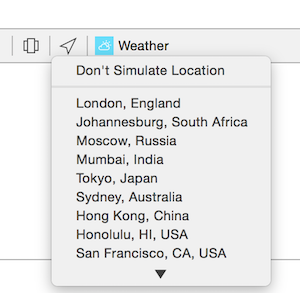

# Introduction to Swift

Tasks

Load the Weather Project into XCode

In your web browser open the following URL in **Safari**, it will help you understand the code better. 

http://api.openweathermap.org/data/2.5/forecast/daily?units=metric&cnt=7&q=coventry,uk

If the JSON code is not nicely formatted you will need to install a browser extension.

https://github.com/rfletcher/safari-json-formatter/downloads

Read through the comments and make sure you understand how the code works.

Now run the app and make sure it works correctly (pull to refesh the tableview). As the app runs study the **console** window. Try to work out what lines of code are generating the lines of output.

Try changing your device location. You could walk around the block but it would be difficult to see the console output without taking your computer! Luckily we can simulator different locations using the **Simulate Location** button and choosing a location from the list.



## Displaying Data in Table Cells

Carefully read the *Data Source* methods with the following signature:
```

func tableView(_ tableView: UITableView, numberOfRowsInSection section: Int) -> Int
func tableView(_ tableView: UITableView, cellForRowAtIndexPath indexPath: NSIndexPath) -> UITableViewCell
```
Make sure you understand what its purpose is. In particular read through the documentation for the classes involved. You can do this by clicking on the string *NSDate* in the editor then opening the **Quick Help** inspector. There is a link at the bottom to take you to the full documentation:

1. UITableView
2. UITableViewCell
3. NSIndexPath
4. NSDate
5. NSDateFormatter

Currently only the date is showing in each cell. Open up the Storyboard, select the table cell and, in the **attribute inspector** change the style from **Basic** to **Right Detail**. Notice how in the cell-for-row-at-indexpath data source method only unwraps and sets the 

Use the existing code as a guide to unwrap the **detailTextLabel**. Display the date in this and, in the main **textLabel** display the weather description and max temperature using string interpolation (there are several examples of this in the code).

The date is only displayed as the day of the month. Modify the formatter's dateFormat string to display the day of the week, day of the month and month name, eg: **Mon Sept 21**. You may need to refer to the following web page:

http://www.codingexplorer.com/swiftly-getting-human-readable-date-nsdateformatter/

## Displaying an Image

In this task you will be displaying a small image in each of the cells to summarise the weather for each day. You will be using two classes:

1. UIImage
2. UIImageView

Read through the documentation for these before continuing.

If you look carefully at the definition of our **Item** struct you will notice that the fourth key is called **icon** and stores a UIImage. Each cell has a built-in **UIImageView** which contains an **image** property. Based on the existing code, modify your app to display the correct weather icon in each UITableViewCell.

## Working with JSON Data

Most iPhone apps interact with online APIs to access useful information and to communicate with other users. In this next activity you will learn how to make GET requests over HTTP to download data in JSON format from an online API.

You will be making use of a number of important classes. Take a look at their documentation before you continue.

1. UIApplication
2. NSURLSession
3. NSURL
4. NSJSONSerialization

Locate the method `getForecast(withCity city: String) -> Void` located near the start of the `TableViewController.swift` file. Use the detailed comments to read through the code so that you understand how it works. Make sure you fully understand how the data is extracted safely from the json data.

Use you knowledge to display the forecasted **air pressure** in the table view cell.

### Test Your Knowledge.

The app already implements location services. You will modify the app to use the device's current location when displaying the weather. The **weather api** allows you to retrieve weather data based on a supplied latitude and longitude.
```
http://api.openweathermap.org/data/2.5/forecast/daily?lat=52.3&lon=-1.53&cnt=7
```
Read the documentation for the following classes:

1. CLLocationManager
2. CLLocationManagerDelegate
3. CLAuthorizationStatus

Study the code to understand the steps undertaken to display the current longitude and latitude in the console.

1. write a new method that takes a latitude and longitude to return weather data and store it in the array
2. call this method to update the weather each time the phone location changes
3. retrieve the location name and display this in the navigation bar

# Advanced

Now you have understood the basics it's time to move onto the more advanced topics. You don't need to know or apply this to pass the module however it is important if you want to get a higher grade.

In this advanced section we will cover several ways to implement an important design pattern called **Model-View-Controller**.