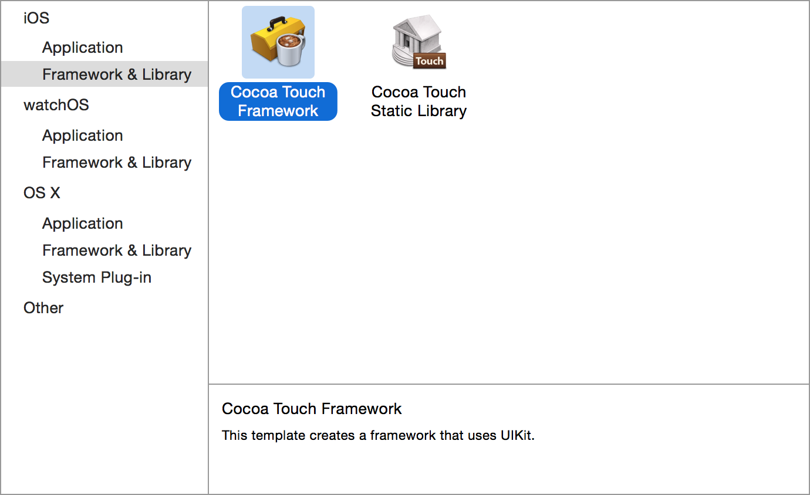

# Frameworks

In this worksheet you will learn how to bundle your business logic into a **Framework**. This is the iOS equivalent of a *Java Library* and means you can develop your business logic completely independently from the UI code.

## 1 Getting Started

Start by creating a new XCode project as before but rather than picking the *Single-View* template, select the **Framework and Library** tab and choose **Cocoa Touch Framework**. Set the project name to **Weather**.

