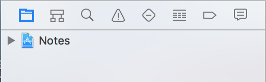
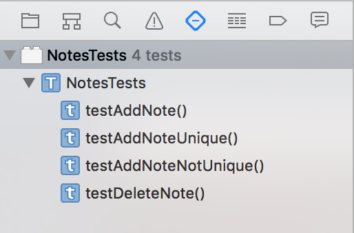
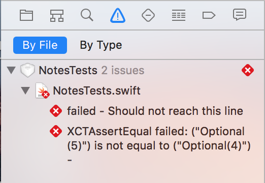
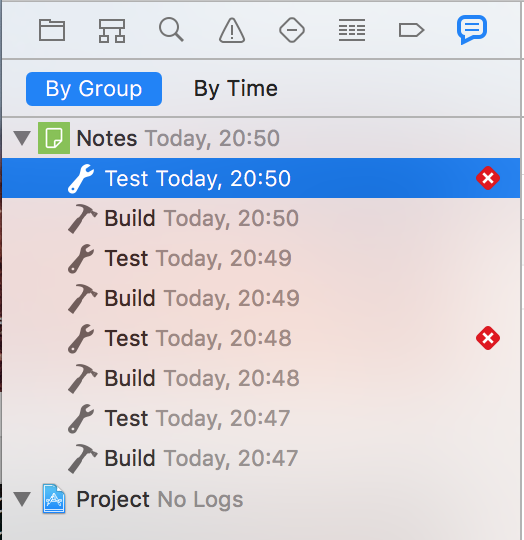
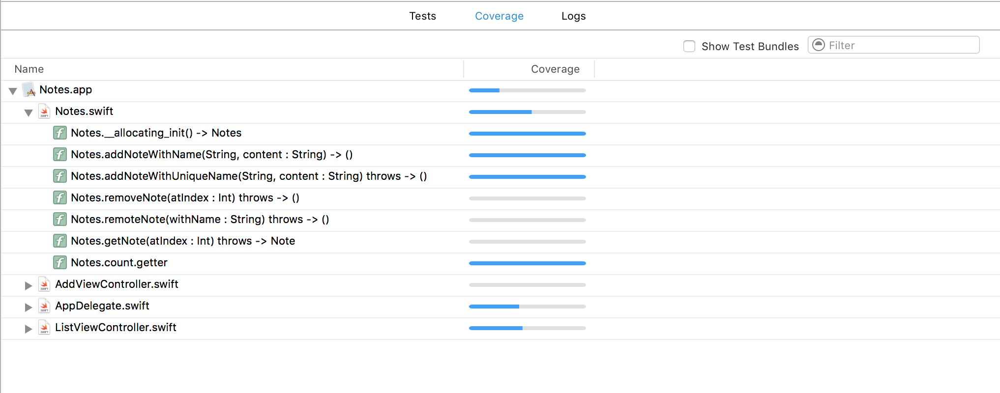

# Automated Testing

In this worksheet we will examine the role of automated testing. This is an essential skill if you are to make a career in the software development industry.

Until now you have carried out your tests by hand. This is time consuming and so there is always the temptation to skip it to focus on the programming. Also, as your app becomes more complex it can take so long to thoroughly test all the features each time you make a change, but if you don't how can you be sure you have not broken something that worked before? By always running tests on all your code base this issues is avoided. This is termed _regression testing_.

Testing can be broken into two main areas:

1. **Unit Testing** that tests each of your code _units_ separately. Typically we define each class as a unit.
2. **Acceptance Testing** (called UI Testing in XCode) which automatically tests the user interface.

XCode testing is managed through the tabs in the _Navigator Pane_ located at the left-edge of the XCode window. Hover over each of the tabs to learn their names.

## 1 Unit Testing
Open the **Notes** project and open the **Test Navigator** tab (5th tab with a diamond shape).

You can see that there is a test _suite_ containing several tests.
Hover over the `testAddNote()` to see a small circle containing a white _play_ arrow. Click on this to run the test. notice the green tick that indicates that this succeeds!

Now run the next test `testAddNoteUnique()`, this also passes, good news...

Next run the third test, `testAddNoteNotUnique()`. This test fails with a red symbol indicating this status. Open the **Issue Navigator** to see a list of the issues.

You can see that two tests have failed. Its time to take a look at the automated tests. Open the **Project Navigator** and locate the `NotesTests.swift` file in the `NotesTests` directory. If you scroll down to the failed test you will see that the failed _assertions_ are flagged in red.

An **assertion** is an expression that evaluates to either _true_ or _false_. If it becomes false the test fails.

Read through the test code carefully, reading the comments, until you are thoroughly familiar with it.

### 1.1 Test Your Knowledge

Make changes to the `Notes` class until the test passes.

## 2 Code Coverage

There need to be enough tests to thoroughly test each route through the code otherwise there may be untested code which can contain errors.

Start by running the entire test suite. This can be done in a single click by hovering over the _test suite_ name in the _Test Navigator_ and clicking on the small grey run button or pressing `cmd+U`.

To identify parts of the code not being tested you need to run a **Code Coverage** tool. XCode has one built-in.

Open the **Report Navigator** and select the last _test_ as shown.

Select the **Coverage** tab in the main window where you will see the current code coverage for each class in your source code. Hover over the blue bar next to `Notes.swift` to see the percentage. Expand the `Notes.swift` row to see which methods are not being fully tested.

Now open the `Notes.swift` class file and study the right-hand margin. The small numbers indicate how many times that block is tested. Red sections indicate code without any tests.

### 2.1 Test Your Knowledge

Armed with the code-coverage report data, write exhaustive unit tests to check all code paths. You should include a large number of tests that check:

1. typical (correct) values
2. error (incorrect) values
3. edge cases

You should also write tests for the `removeNote:index` and `removeNote:name` methods even though these will fail.

## 3 Test-Driven Development

So why write tests that we know will fail? This is part of a _software development process_ called [Test-Driven Development](https://en.wikipedia.org/wiki/Test-driven_development) (TDD) that is designed to improve software quality.

This involves the following steps:

1. write an automated test for the new functionality (this should fail)
2. write _just enough code_ for the test to pass (then commit)
3. refactor the code without breaking the test (then commit)

### 3.1 Test Your Knowledge

1. you have already written failing tests for the `removeNote:index` and `removeNote:name` methods.
2. modify the `Notes.swift` code so that the tests pass
3. commit your code
4. tidy up (refactor) the code and add documentation
5. commit your code again.

Congratulations, you have learned how to use automated tests to improve your workflow and have tried out TDD.
